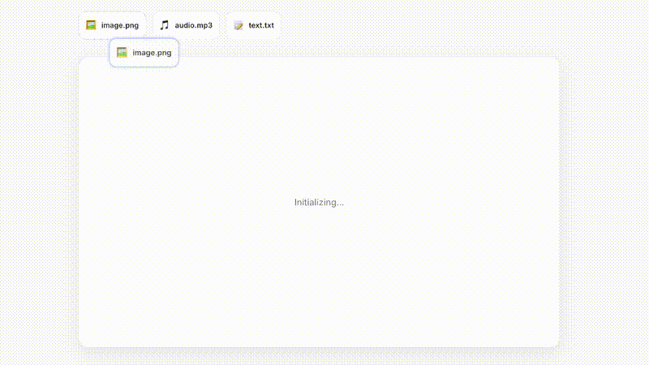
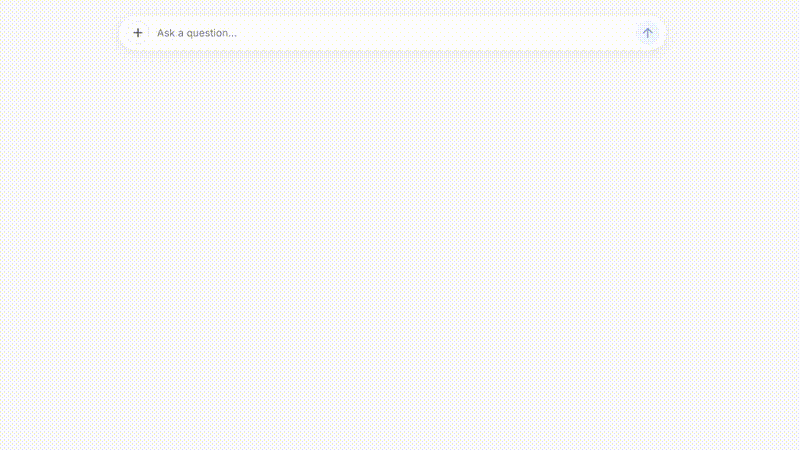
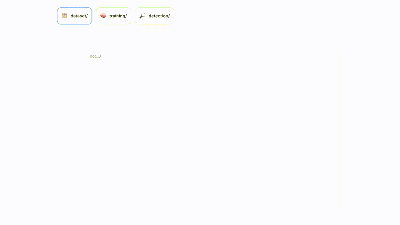

# Meta Seal
## State-of-the-Art, Open Source Invisible Watermarking

---

### 🌐 **[Visit the Meta Seal Website →](https://facebookresearch.github.io/meta-seal)**

**Explore research papers, interactive demos, and comprehensive documentation**

---

| Repository | Description | Stars |
|------------|-------------|-------|
| [**Video Seal**](https://github.com/facebookresearch/videoseal) | Image & Video Watermarking |  |
| [**Audio Seal**](https://github.com/facebookresearch/audioseal) | Audio Watermarking |  |
| [**Text Seal**](https://github.com/facebookresearch/textseal) | Text Watermarking |  |
| [**Dist Seal**](https://github.com/facebookresearch/distseal) | In-Model Latent Space Watermarking |  |
| [**Stable Signature**](https://github.com/facebookresearch/stable_signature) | Latent Diffusion Watermarking |  |
| [**WAM**](https://github.com/facebookresearch/watermark-anything) | Watermark Anything Model |  |
| [**WMAR**](https://github.com/facebookresearch/wmar) | Autoregressive Image Generation |  |

---

## 📖 Overview

**Meta Seal** is a comprehensive, open-source framework for invisible, robust watermarking across **all modalities**: audio, image, video, and text. This suite spans the entire generative AI lifecycle—from training data and inference to generated media—providing state-of-the-art tools for content provenance and authentication.

---

## 🎬 Post-Hoc Watermarking

Watermarks applied **after content generation** by any model or system. Model-agnostic and universal across all content types.

### Image & Video Models

| Model | Description | Resources |
|-------|-------------|-----------|
| **PixelSeal** | 🏆 Flagship image & video watermarking model SOTA in terms of robustness and imperceptibility, built with a better and more stable adversarial-only training paradigm | [Paper](https://ai.meta.com/research/publications/pixel-seal-adversarial-only-training-for-invisible-image-and-video-watermarking/) • [Code](https://github.com/facebookresearch/videoseal) |
| **ChunkySeal** | Bigger model with 4× capacity boost to 1024 bits while preserving quality and robustness | [Paper](https://arxiv.org/abs/2510.12812) • [Code](https://github.com/facebookresearch/videoseal) |
| **VideoSeal** | Extension of image watermarking models to video, resilient to editing and video codecs | [Paper](https://arxiv.org/abs/2412.09492) • [Code](https://github.com/facebookresearch/videoseal) • [▶️ Demo](https://aidemos.meta.com/videoseal) |
| **WAM** | Embed (possibly multiple) localized watermarks into images, survives inpainting and splicing attacks | [Paper](https://arxiv.org/abs/2411.07231) • [Code](https://github.com/facebookresearch/watermark-anything) |
| **SyncSeal** | Watermarking models for robust image synchronization, enabling to revert geometric transformations applied to image | [Paper](https://arxiv.org/abs/2509.15208) • [Code](https://github.com/facebookresearch/watermark-anything) |

### Audio Models

| Model | Description | Resources |
|-------|-------------|-----------|
| **AudioSeal & AudioSeal Streaming** | Localized audio watermarking with sample-level detection and streaming support for real-time applications | [Paper](https://arxiv.org/abs/2401.17264) • [Code](https://github.com/facebookresearch/audioseal) |

### Text Models

| Model | Description | Resources |
|-------|-------------|-----------|
| **TextSeal** | Comprehensive evaluation framework for post-hoc text watermarking with LLM rephrasing | [Paper](https://ai.meta.com/research/publications/how-good-is-post-hoc-watermarking-with-language-model-rephrasing/) • [Code](https://github.com/facebookresearch/textseal) |

---

## 🔄 In-Model & Generation Time Watermarking

Watermarks embedded **during content generation** by modifying model behavior or latent representations.

| Model | Description | Resources |
|-------|-------------|-----------|
| **DISTSEAL** | Unified latent space watermarking that enables 20× speedup over pixel methods and secures open-source models via in-model distillation | [Paper](https://ai.meta.com/research/publications/distilling-latent-space-watermarkers-into-generative-image-models/) • [Code](https://github.com/facebookresearch/distseal) |
| **Stable Signature** | Roots the watermark in the model's latent decoder for tracing the outputs of latent generative models | [Paper](https://arxiv.org/abs/2303.15435) • [Code](https://github.com/facebookresearch/stable_signature) |
| **WMAR** | Watermarking for autoregressive image generation models | [Paper](https://arxiv.org/abs/2506.16349) • [Code](https://github.com/facebookresearch/wmar) |

---

## 📊 Dataset Watermarking

Watermarks embedded **into training datasets** to track data provenance and detect unauthorized usage.

| Research | Description | Resources |
|----------|-------------|-----------|
| **Radioactive watermarks** | Designed to detect if a language model was trained on synthetic text by detecting weak residuals of watermark signals in fine-tuned LLMs, with high confidence detection even when as little as 5% of training text is watermarked | [Paper](https://arxiv.org/abs/2402.14904) • [Code](https://github.com/facebookresearch/radioactive-watermark) |
| **Detecting benchmark contamination through watermarking** | Watermarks benchmarks before release to detect if models were trained on test sets, using theoretically grounded statistical tests to identify contamination while preserving benchmark utility | [Paper](https://arxiv.org/abs/2502.17259) • [Code](https://github.com/facebookresearch/textseal) |

---

## 🔒 Watermark Security

Research on **adversarial attacks and defenses** for watermarking systems through red teaming.

| Research | Description | Resources |
|----------|-------------|-----------|
| **WMForger** | Black-box watermark forging using image preference models for red-teaming watermarking systems | [Paper](https://arxiv.org/abs/2510.20468) • [Code](https://github.com/facebookresearch/videoseal/tree/main/wmforger) |

## 🧾 License

The code is licensed under an [MIT license](LICENSE).

